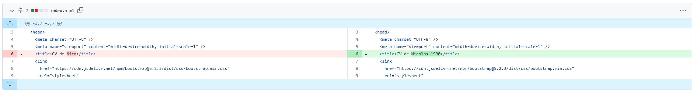

Se realiza fork al proyecto de Nicolas Perry (https://github.com/Nico-Perry-1990/desafio-final)
Se aloja en mi repositorio (https://github.com/VruceCrassus/desafio-final)
Se hace un commit en línea 6 de index.html

Se realiza fork al proyecto de Felipe Torres (https://github.com/ftorresv/prueba1_desafio_latam)
Se aloja en Repositorio (https://github.com/VruceCrassus/Fork_FTorres)
